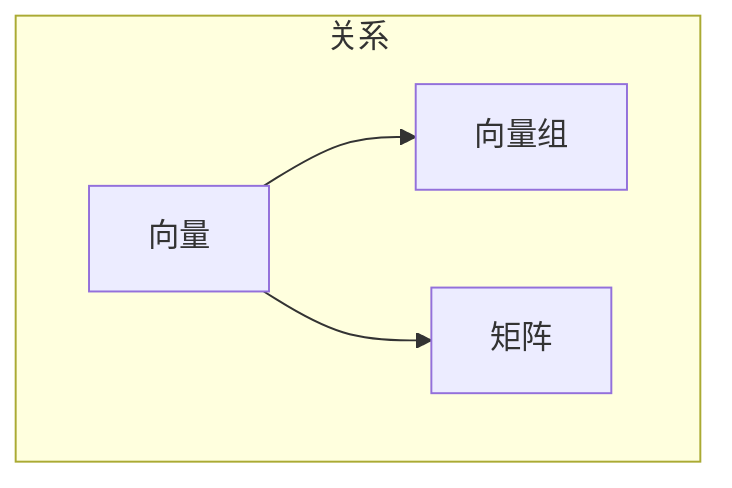

## 总览

- 向量 ｜
- 向量组 ｜ 张成与线性无关
- 矩阵A ｜ 把向量做线性变换的“机器”
- 行列式 ｜ 度量A这个变换把提及缩放了多少？也判定可逆性
- 线性方程组 ｜ Ax = b, 问b能否由A的列向量线性组合得到（是否在列间）
- 特征值/特征向量 ｜ 找在A作用下只被拉伸不改变方向的向量（Av=qv）
- 二次型/x转置Qx ｜ 与对称矩阵Q绑定，通过特征分解把“斜着的碗”变成坐标轴对齐的碗

